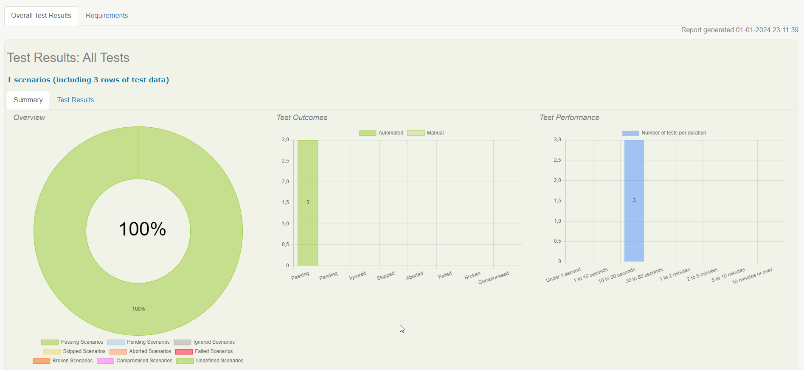
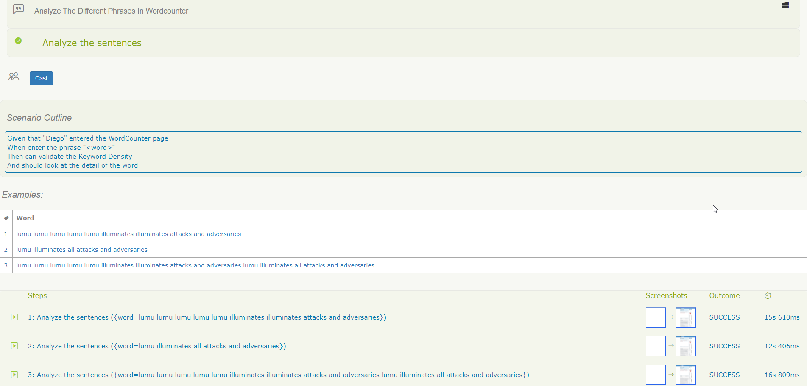

# CHALLENGE AUTOMATIZACIÓN LUMU

---

### Herramientas implementadas:
* Serenity BDD
* Selenium
* Cucumber
* JUnit
* Lombok

### Patron de diseño: 
* Screenplay-BDD

### Lenguaje de programación:
* Java

### Gestor de dependencias:
* Gradle

---

## Pre-Condiciones:
* Tener instalado el [JDK](https://www.oracle.com/co/java/technologies/javase/javase8-archive-downloads.html) Java con versione igual o superior a 1.8
* Tenerinstalado y configurado [GRADLE](https://gradle.org/releases/).
* Dado que los test se ejecutan en diferentes navegadores, es importante tener instalado los siguientes navegadores ([Chrome](https://www.google.com/intl/es_es/chrome/), [Firefox](https://www.mozilla.org/es-ES/firefox/new/) , [Edge](https://www.microsoft.com/es-es/edge?form=MA13FJ))
* Clone el proyecto de la rama **main** con el siguiente comando:
  * `git clone https://github.com/dfmerchan2/challenge-devsu.git`

---

## Compilar y ejecutar
* Puedes ejecutar la clase runner **"WordCounterRunner"** o ejecutar por consola el comando de gradle `gradle clean test aggregate -i`
* Cuando finalice la ejecución del test, ingrese à la ruta **"target/site/serenity"** y abra el archivo **index.html** en el navegador, para poder visualizar el reporte de Serenity.

---

## Evidencia de informe de ejecución

---

## UI Importante
1. La página WEB podría mejorar la usabilidad para las personas que sean discapacitadas. 
2. La página WEB podría mejorar la experiencia de usuario cuando se usa de forma response en resolución móvil, ya que en ocasiones los iconos no se visualizan de forma adecuada.
3. La Página WEB podría implementar "data-TestId" o "id" en los diferentes elementos para que sea mucho más fácil realizar la automatización.

## Autor 🤖

* Diego Fernando Merchan Jimenez
    